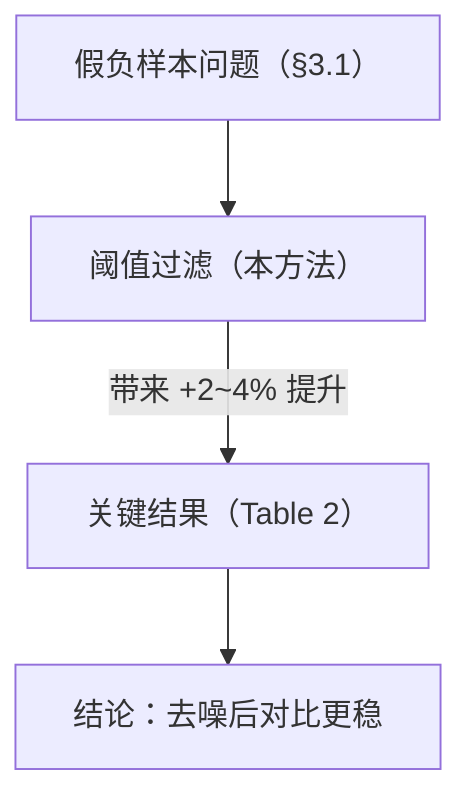

# 实验方法型条目模板（entry-method）

适用于 **实验 / 方法 / ML / 系统 / 数据集** 类论文里的每个"承重单元"。一个承重单元 = 一个核心方法、一个关键实验、一条主要结论、或一组主要局限——删掉它，论文的论证就不完整。每个单元写**一个独立的 `.md` 文件**。

文件名 = 单元名（如 `method.md`、`experiments.md`、`key-result.md`、`limitations.md`）。

本文件自包含：骨架 → 构造要点 → 风格约定 → 一个简短范例。

> **防幻觉铁律**（写之前先看 SKILL.md §3）：每个公式 / 数字 / 结论都必须能挂回原文 `(p.X)` / `Table N` / `Figure N` / 直接引用；挂不上就标 `⚠️ 待核`，绝不编造；论文没讨论的章节写"原文未讨论"。

---

## 一、骨架（按单元类型选用小节，照填）

<斜体 `<...>` 是占位符，写完删掉。不是每个小节都用——核心方法条目重点写"方法"，实验条目重点写"实验"，按需裁剪。>

````markdown
## <单元类型：核心方法 / 关键实验 / 主要结论 / 主要局限>：<一句话名称>

> <这个单元在论文里的定位 + 它断言/给出了什么，用 blockquote。核心数字/公式用 `$$\boxed{}$$`。>
> （出处：p.<X>，Table/Figure <N>）

**含义 / 一句话总结**：<大白话说这个单元在干什么/得出了什么。不要复述上面的公式。>

---

## 1. 问题与动机
<这个单元针对的子问题是什么？为什么需要它/为什么难？2–4 句。>

---

## 2. 方法 / 算法 / 设计
<仅"方法类"单元详写。核心 idea → 形式化描述（伪代码/公式，标出处）→ 关键假设。>

$$\boxed{\;<核心公式或目标函数，标 p.X>\;}$$

| 符号 / 项 | 含义 |
|------|------|
| $X$ | <……> |

**直观**：<一两句讲它为什么这么设计。>

---

## 3. 实验设置 / 关键结果
<仅"实验类"单元详写。数据集/基线/指标 + 关键数字。>

| 实验 | 设置 | 结果 | 出处 |
|------|------|------|------|
| <名字> | <数据/基线/指标> | <数字> | p.<X>, Table <N> |

> 用到了 <基线/前置方法>；对比 <对照>。

---

## 4. 为什么有效 / 为什么非平凡
<专门一节回答"这难道不是显然的吗"。点出真正起作用的那一点、或容易被忽略的陷阱。>

> **<加粗的核心洞察。>**

---

## 5. 局限与适用边界
<原文明确说的局限、适用前提。原文没写的，写"原文未讨论"，**不要替作者编局限**。>

---

## 6. 复现要点（可抓取的线索）
<把散落全文的复现线索收拢：数据/代码链接、关键超参、算力、随机种子、评测协议。原文没给的标"未给出"。>

---

## 7. 在大图景中的角色
<这个单元服务于谁、被谁支撑。画依赖/结构图（关系用 mermaid；模块布局用 SVG），并链回 [README.md](README.md) 与相关条目。>
````

---

## 二、构造要点（anatomy）

| 章节 | 方法类 | 实验类 | 结论类 | 局限类 | 常见错误 |
|------|:--:|:--:|:--:|:--:|------|
| 标题 + 定位 + 出处 | ✅ | ✅ | ✅ | ✅ | 出处缺失（违反防幻觉铁律） |
| 含义（大白话） | ✅ | ✅ | ✅ | ✅ | 把公式用汉字念一遍 |
| 问题与动机 | ✅ | 看情况 | 看情况 | ✅ | 背景铺太长 |
| 方法/算法 | ✅ | — | — | — | 只写"用了 transformer"不讲关键设计 |
| 实验设置/结果 | — | ✅ | ✅ | — | 数字不标出处、不列对照 |
| 为什么有效/非平凡 | ✅ | ✅ | ✅ | 看情况 | 跳过这节，直接罗列 |
| 局限与适用边界 | 推荐 | 推荐 | 推荐 | ✅ | 替作者编造原文没有的局限 |
| 复现要点 | 推荐 | ✅ | — | — | 漏掉超参/数据/算力 |
| 大图景角色 + 互链 | ✅ | ✅ | ✅ | ✅ | 只写"是论文的一部分" |

## 三、风格约定

- **语言**：中文为主（数学符号、专有名词、数据集名保留原文）；跟随用户语言。
- 行间公式 `$$...$$`，行内 `$...$`；核心结论用 `\boxed{}`。
- **数字一律标出处**：`87.3% (p.7, Table 2)`。拿不准的数字标 `⚠️ 待核`，不写近似值冒充精确值。
- **配图**：依赖/流程/架构关系用 **mermaid**（节点内数学用纯文本，勿用 `$...$`，分行用 `<br/>`）；模块布局/数据流等二维结构用 **SVG**（**裸写**内联 `<svg>`，⚠️ 勿包进 ``` 代码块否则不渲染，写法见 [SKILL.md](../SKILL.md) §4）。
- 章节之间用 `---` 分隔；跨文件引用用相对链接。

---

## 四、范例条目（简短锚点）

下面是一个**核心方法条目**的写法示范（虚构示例，仅示意结构与密度）。

````markdown
## 核心方法：对比学习 + 负样本去噪

> 在标准 InfoNCE 上叠加一个"难负样本过滤"模块：对每个 anchor，丢弃与正样本相似度高于阈值 $\tau$ 的负样本后再算对比损失。
> $$\boxed{\;\mathcal{L} = -\log \frac{e^{s(x,x^+)/\tau_0}}{\sum_{x^- \in \mathcal{N}'} e^{s(x,x^-)/\tau_0}}\;}$$ （出处：p.4, Eq. 3）

**含义 / 一句话总结**：训练时先把"伪装成负样本、其实接近正样本"的干扰项剔掉，再算对比目标，避免它们把表示拽偏。

---

## 1. 问题与动机
标准对比学习把 batch 内所有非正样本当负样本，但其中有些其实和 anchor 语义接近（"假负样本"），会给出错误梯度（p.3, §3.1 动机分析）。

---

## 2. 方法
阈值过滤构造 $\mathcal{N}' = \{x^- : s(x,x^-) < \tau\}$，再套 InfoNCE（p.4, Eq. 3）。$\tau$ 既控制过滤强度，也在分母充当温度。

**直观**：相似度高于 $\tau$ 的样本"太像正样本"，不参与对比——等价于只和"确实不同"的样本拉开距离。

---

## 3. 关键结果
| 数据集 | 指标 | 本方法 | 基线 | 出处 |
|------|------|------|------|------|
| CIFAR-10 | top-1 acc | 94.2% | 91.5% | p.7, Table 2 |
| ImageNet-100 | top-1 acc | 81.0% | 77.3% | p.7, Table 2 |

---

## 4. 为什么有效 / 为什么非平凡
看似"去掉一些负样本"会减弱对比信号，但假负样本的梯度方向是错的——去掉它们反而让有效梯度更干净（p.5, §4.2 消融：关掉过滤掉 2.1 个点）。

> **难负样本不总是"好负样本"——相似度过高的负样本是有害梯度源。**

---

## 5. 局限与适用边界
阈值 $\tau$ 需按数据集调（p.8, §5 讨论了敏感性）；超大数据集上的过滤开销原文未充分讨论。

---

## 6. 复现要点
- 代码：原文称将开源（链接未给出，⚠️ 待核）。
- 关键超参：$\tau=0.5$，batch=512，温度 $\tau_0=0.07$（p.6, 实现细节）。
- 算力：4×A100，未给训练时长。

---

## 7. 在大图景中的角色

见 [README.md](README.md) 与 [experiments.md](experiments.md)。
````

> 范例是**虚构**的，只演示结构。真实条目里每个数字、公式都要真实可溯源。
