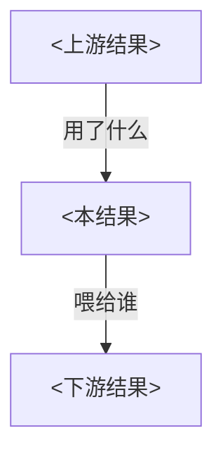
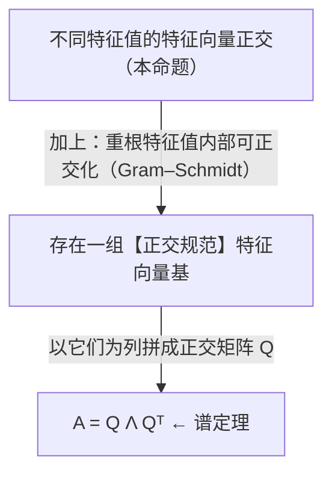

# 理论证明型条目模板（entry-theory）

适用于**理论 / 证明型**论文：把每个承重的定理 / 引理 / 命题 / 推论写成**一个独立的 `.md` 文件**。文件名 = 结果编号（如 `Theorem1.md`、`LemmaS4.md`、`PropositionS1.md`）。

判断是否"承重"：删掉它，主定理（或论文核心结论）的证明就断了 → 承重，单独成文；平凡的辅助事实并进引用它的那条里讲。

本文件自包含：骨架 → 构造要点 → 风格约定 → 一个自包含范例。

> **防幻觉铁律**（写之前先看 SKILL.md §3）：形式陈述、每步用到的前置结果、每个公式都要能挂回原文 `(p.X)` / `Eq.(N)` / 直接引用；挂不上就标 `⚠️ 待核`，绝不编造；Unicode 残缺公式必须视觉核对后再写成 LaTeX。

---

## 一、骨架（照填）

<斜体 `<...>` 是占位符，写完删掉。>

````markdown
## <结果类型> <编号>：<一句话中文名称>

> <形式化陈述，用 blockquote。核心公式用 $$\boxed{...}$$ 框起来。>
> $$\boxed{\;<核心公式>\;}$$
> （出处：p.<X>，Eq.(<N>)）

**含义 / 一句话总结**：<用最朴素的大白话说这个结果在断言什么。不要重复公式，说"人话"。>

---

## 1. 先建立直觉 / 关键概念定义
<仅当结果引入了新符号或新概念时才写这一节。>

$$\boxed{\;<关键定义，标 p.X>\;}$$

逐项解释：

| 符号 / 项 | 含义 |
|------|------|
| $X$ | <……> |

**直观**：<一两句的物理 / 几何 / 组合直觉。>

---

## 2. 证明 / 推导（分步，完整不跳步）
<把证明**完整展开、不跳步**——读者照着就能验算到底。**禁止"见 SM / 见附录 / 证明略"式搪塞**：论文放 SM 的推导要搬进来展开；拿不到 SM 就基于严谨数学自行补全并标「**【补推】**」。每步一个 `### 第 N 步：<这步在干什么 + 为什么>`。>
<每步末尾标注依据：用到哪条前置结果 / 恒等式 / 不等式，方向如何，并尽量标原文出处。鼓励补上论文省略的中间代数步，必要时比原文更详细。>

### 第 1 步：<做什么>
<推导。>
> 用到了 <前置结果 / 恒等式>（p.<X>）。

### 第 2 步：<做什么>
<推导。>

$$\boxed{\;<这一步的结论>\;}$$

---

## 3. 直观理解 / 为什么它非平凡
<专门一节回答："这个结果看起来难道不是显然的吗？"——指出那个容易被忽略的陷阱、或方向容易记反的不等式。>

> **<加粗的核心洞察。>**

---

## 4. 在大图景中的角色
<这条结果为谁服务？谁又为它服务？把上游、本结果、下游连成依赖流程图（mermaid），并链回 [README.md](README.md) 与相关条目。>



---

## 5. 物理/直观意义 / 结论表（主定理必写；引理可省）
| 结论 | 意义 |
|------|------|
| <公式> | <含义> |
````

---

## 二、构造要点（anatomy）

| 章节 | 必需？ | 作用 | 常见错误 |
|------|------|------|---------|
| 标题 + 形式陈述 + 出处 | ✅ | 让读者一眼看到"断言了什么" | 陈述里夹带证明思路；出处缺失（违反防幻觉铁律） |
| 含义（大白话） | ✅ | 把公式翻译成人话 | 只是把公式用汉字读一遍 |
| 直觉 / 概念定义 | 看情况 | 引入新符号时才需要 | 定义了符号却不解释"它在量什么" |
| 分步证明 | ✅ | 让推导可被逐步追问、完整验算 | 步太大、跳步、不标前置结果与出处、用"见 SM"搪塞 |
| 为什么非平凡 | ✅ | 区分"懂了"和"背了" | 跳过这节，直接进下一节 |
| 大图景角色 | ✅ | 把孤立的引理焊进主证明 | 只写"它是证明的一部分"这种废话 |
| 意义表 | 主定理 ✅ / 引理可省 | 收束到 take-away | 引理也硬塞一张意义表 |

## 三、风格约定（写死，照做）

- **语言：中文**（数学符号、变量名保留原文）；跟随用户语言。
- 行间公式 `$$...$$`，行内 `$...$`；核心结论用 `\boxed{}`。
- **公式一律规范 LaTeX**，绝不照抄 `pdftotext` 的 Unicode 残缺体（`Ω`→`Ω`、`∣`→`|`、`∶`→`:`、`ρs`→`$\rho_s$`、`≤`→`$\leq$`）。重建不确定的公式前，用 Read 工具按页读 PDF 图片核对。
- **配图按类型分治**：证明流 / 依赖关系用 **mermaid** 流程图（` ```mermaid ` + `flowchart TD`）；几何 / 空间结构（光锥、区域划分、同心层、模块布局）用 **SVG**（**裸写**内联 `<svg>`，⚠️ 勿包进 ``` 代码块否则不渲染，写法见 [SKILL.md](../SKILL.md) §4）；极简单行示意才用 ASCII。mermaid 画不出几何图。
- **mermaid 节点里的数学用纯文本**（`A = Q Λ Qᵀ`），**不要用 `$...$`**；需要分行用 `<br/>`。
- 章节之间用 `---` 分隔；跨文件引用用相对链接：`见 [Theorem1.md](Theorem1.md) 第 3 步`。

---

## 四、范例条目（自包含质量锚点）

下面是一个**完整写法**的范例，用一道线性代数小命题演示各章节该写到什么程度。把它当"达标长这样"的标尺。前三节展示**源码写法**；第 4 节的 mermaid 会直接渲染。

````markdown
## 命题：实对称矩阵不同特征值的特征向量相互正交

> 设 $A$ 为实对称矩阵（$A = A^\top$），$v, w$ 分别是属于不同特征值 $\lambda \neq \mu$ 的特征向量。则
> $$\boxed{\;\langle v, w\rangle = 0\;}$$
> （出处：线性代数标准结论）

**含义 / 一句话总结**：对称矩阵的"特征方向"彼此天然垂直——属于不同特征值的那些方向，谁也不"倾斜"向谁。

---

## 1. 为什么需要"对称"这个前提

先把"对称性"翻译成内积语言。对任意向量 $x, y$：

$$\boxed{\;\langle Ax, y\rangle = \langle x, Ay\rangle\;}$$

| 表达 | 含义 |
|------|------|
| $\langle Ax, y\rangle = (Ax)^\top y$ | $A$ 作用在"左边"再和 $y$ 做内积 |
| $\langle x, Ay\rangle = x^\top Ay$ | $A$ 作用在"右边" |
| 二者相等 | **对称性 = $A$ 可以在 $\langle\cdot,\cdot\rangle$ 里左右换位** |

**直观**：对称矩阵在内积下"自伴"——把它从左搬到右不改变内积值。这就是后面那一步的入场券。

---

## 2. 证明（三步）

### 第 1 步：用 $v$ 的特征方程把 $\lambda$ 提出来
$$\langle Av, w\rangle = \langle \lambda v, w\rangle = \lambda\langle v, w\rangle$$
> 用到了 $Av = \lambda v$。

### 第 2 步：用对称性把 $A$ 换到 $w$ 上，再用 $w$ 的特征方程
$$\langle Av, w\rangle = \langle v, Aw\rangle = \langle v, \mu w\rangle = \mu\langle v, w\rangle$$
> 用到了对称性 $\langle Av,w\rangle=\langle v,Aw\rangle$ 与 $Aw = \mu w$。

### 第 3 步：两式相等，移项收尾
第 1、2 步给出同一个量 $\langle Av, w\rangle$ 的两个表达式：

$$\lambda\langle v, w\rangle = \mu\langle v, w\rangle \;\Longrightarrow\; (\lambda - \mu)\langle v, w\rangle = 0$$

由 $\lambda \neq \mu$ 知 $\lambda - \mu \neq 0$，故

$$\boxed{\;\langle v, w\rangle = 0\;}$$

---

## 3. 直观理解 / 为什么它非平凡

读到这里你可能想："特征向量不就是一个个独立的方向吗？垂直不是显然的？"

**不是。** 对一个**非对称**矩阵，这一步立刻崩盘：第 2 步的 $\langle Av, w\rangle = \langle v, Aw\rangle$ 不成立，$Aw \neq \mu w$，结论也就不成立——非对称矩阵的（右）特征向量一般**不正交**。

> **对称性的全部威力，就浓缩在第 2 步那一次"换位"里。** 没有对称性，$\lambda$ 和 $\mu$ 无法被放到等号同侧做差，正交性无从谈起。

---

## 4. 在大图景中的角色

这条命题是**谱定理**（"实对称矩阵可被正交矩阵对角化"）的拼图之一：



> 它把"代数对称性"翻译成了"几何正交性"，是整条谱定理链上第一个、也是最干净的环节。见 [README.md](README.md)。
````

---

**记住**：每个真实条目都要达到上面这个范例的密度——纯陈述、大白话含义、分步且标前置结果与出处的证明、专门的"为什么非平凡"、焊进全局的流程图（依赖用 mermaid，几何用 SVG）。少任何一节，就还没写够。
