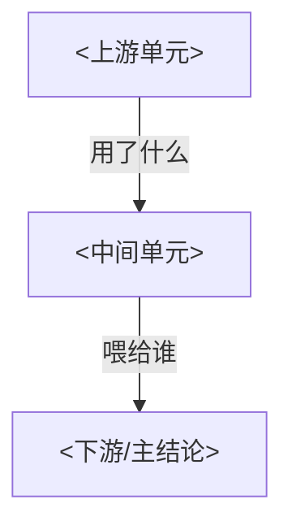

# 论文总览模板（overview / README）

**每篇论文都必须产出这一个文件**（通常命名为 `README.md`，放在该论文的输出文件夹根目录）。它是整篇论文的**导航中枢**：读者从任何一个条目文件进来，都能顺着它摸清全篇的论证骨架与条目间关系。

本文件只负责"全局视野 + 导航"，**不重复**各条目里的细节。条目细节走对应类型模板（`entry-theory.md` / `entry-method.md`）。

---

## 一、骨架（照填）

<斜体 `<...>` 是占位符，写完删掉。元信息缺失就留空或写"未给出"，**不要编造**。>

````markdown
# <论文标题>

| 项 | 内容 |
|----|------|
| 作者 | <从 PDF/首页取；不确定标"未给出"> |
| 年份/出处 | <会议/期刊/arXiv 编号；不确定标"未给出"> |
| 类型 | <理论证明 / 实验方法 / 综述 / 系统 —— 来自分诊> |
| 一句话 | <这篇到底断言/贡献了什么？用最朴素的大白话，≤30 字> |

---

## 这篇在解决什么问题

<2–4 句：问题背景 + 为什么难/为什么重要 + 本文给的是什么形态的答案。不要复述摘要，提炼。>

---

## 结果 / 贡献地图

<把每个"承重单元"列成一项，每项一句话定位 + 链到对应条目文件。这是本文件的核心。>

| 单元 | 一句话定位 | 条目文件 |
|------|----------|---------|
| <主定理 / 核心方法 / …> | <它说了什么> | [Theorem1.md](Theorem1.md) |
| <承重引理 / 关键实验 / …> | <它在链条里的作用> | [LemmaS3.md](LemmaS3.md) |
| … | … | … |

---

## 骨架图：论证/结构怎么连起来

<按论文类型选一种图。证明流/依赖链/分类树用 **mermaid**；几何/模块布局用 **SVG**（写法见 [SKILL.md](../SKILL.md) §4）。>



---

## 论证逻辑链（鸟瞰）

<5–10 行讲清整条证明/论证是怎么从起点走到结论的。理论型：定理依赖哪些引理、关键不等式在哪一步；实验型：方法→实验设置→关键结果→结论 怎么收束。读到这份overview的人应该立刻知道"哪一步是关键、哪一步可跳过"。>

---

## 建议阅读顺序

**第 0 步固定是 [导读.md](导读.md)**（30 分钟读懂核心思路，见 guide-template.md）；之后给读者一条路：先读哪个条目、为什么。例如"先读 [Theorem1.md](Theorem1.md) 看全局，再按 Lemma S1→S3→S6 的顺序补证明链"。
````

---

## 二、构造要点

| 章节 | 必需？ | 作用 | 常见错误 |
|------|------|------|---------|
| 元信息表 | ✅ | 让读者立刻知道这是什么 | 作者/年份拿不准时**编造**（应留空或标"未给出"） |
| 一句话 | ✅ | 压缩全文主旨 | 写成摘要的复述，没有"压缩" |
| 在解决什么问题 | ✅ | 交代动机与答案形态 | 背景铺太长，冲掉主旨 |
| 结果/贡献地图 | ✅ | 导航中枢，串起所有条目 | 只列文件名不写定位；或漏掉承重单元 |
| 骨架图 | ✅ | 一图看全篇结构 | 用 mermaid 画二维几何（画不出） |
| 论证逻辑链 | ✅ | 鸟瞰"怎么走到结论" | 写成各条目摘要的拼接，没有"链" |
| 建议阅读顺序 | 推荐 | 给读者一条路 | 列全文件却不排序 |

## 三、按类型的差异

- **理论证明型**：骨架图 = mermaid 依赖链（引理→定理）；逻辑链讲证明的关键转折与不等式方向。
- **实验方法型**：骨架图 = `问题 → 方法 → 实验 → 结论` 的结构图；地图里列"核心方法/关键实验/主要结论/主要局限"各为一条目。
- **综述型**：骨架图 = 分类树（mermaid `mindmap` 或 `flowchart`）；地图里列每个子方向/里程碑工作一条。
- **系统型**：骨架图 = 架构/数据流图（模块布局用 **SVG**）。

## 四、风格约定

- **语言**：中文为主（数学符号、专有名词保留原文）；跟随用户语言。
- 骨架图：依赖/流程/分类用 **mermaid**（节点内数学用纯文本，勿用 `$...$`，需分行用 `<br/>`）；几何/模块布局用 **SVG**。
- 所有条目引用用相对链接：`见 [LemmaS3.md](LemmaS3.md)`。
- **元信息拿不准就留空**，绝不编造作者、年份、出处。
